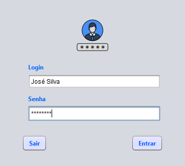
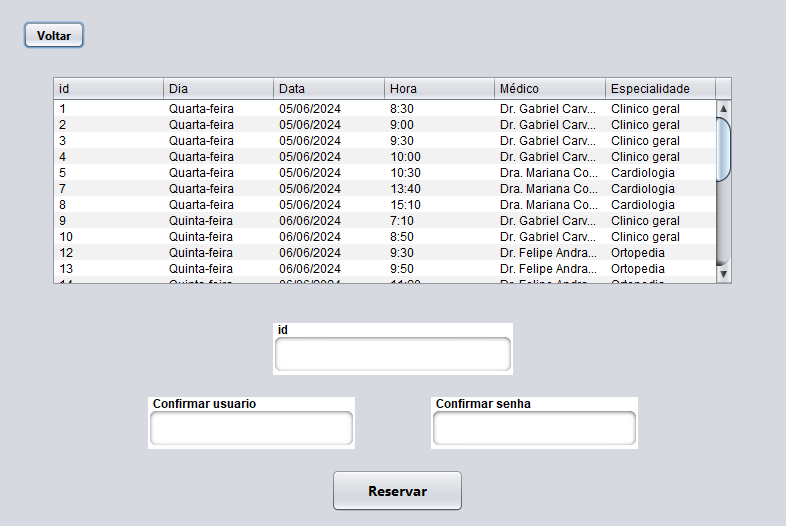
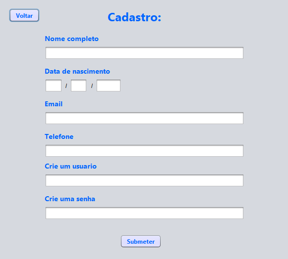
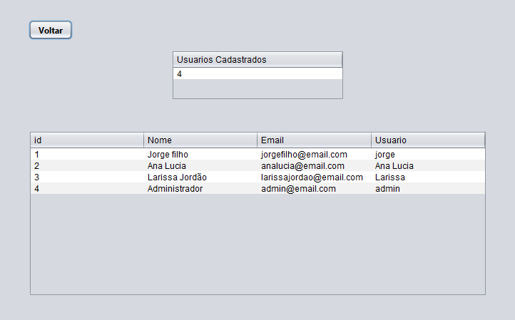

# Agenda Clinica

Alfa Clínica é um sistema de agendamento de consultas desenvolvido em Java com MySQL.
O projeto permite o cadastro de usuários, login, marcação e desmarcação de consultas, além de um painel administrativo para gestão do sistema.
 

## 🌐Tecnologias utilizadas

- Java 
- MySQL 
- NetBeans 

### 💻Como executar o projeto
- Faça dowload do projeto em arquivo zip. 
- Extraia os conteúdos do arquivo.
#### Banco de dados
- Instale o MySQL e crie um banco de dados 
- Importe o arquivo <em>Database</em> para criar as tabelas.
<h4>Executando o projeto</h4>
- Importe o projeto <em>AlfaClinica</em> na IDE de sua preferência (NetBeans recomendado) 
- Compile e execute o projeto

## ⚙️Principais funcionalidades
- 📌 **Cadastro e login** de usuários.
- 🗓 **Agendamento e cancelamento** de consultas.
- 🔑 **Login administrativo** que permite gerenciar consultas e exames.  
  _(Cadastro de administradores deve ser feito diretamente no banco de dados.)_
  

 

## 🖥️Interfaces

_Login administrativo:_

